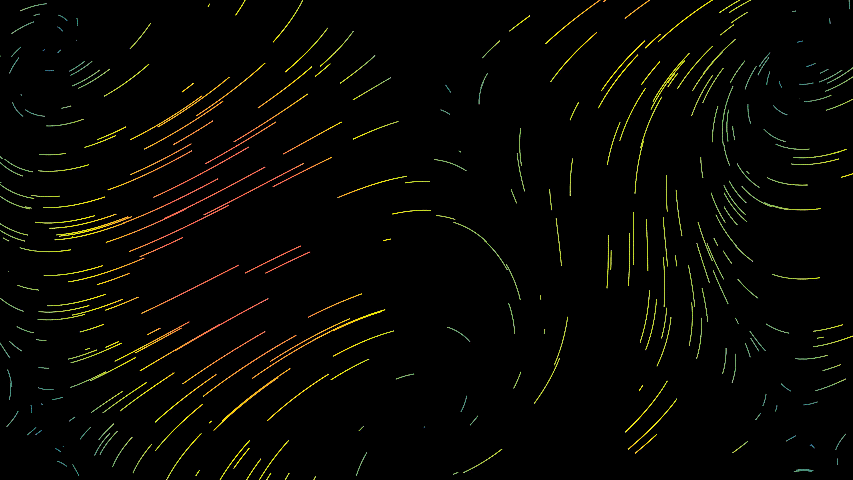
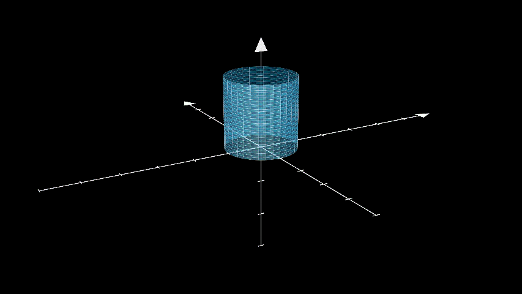
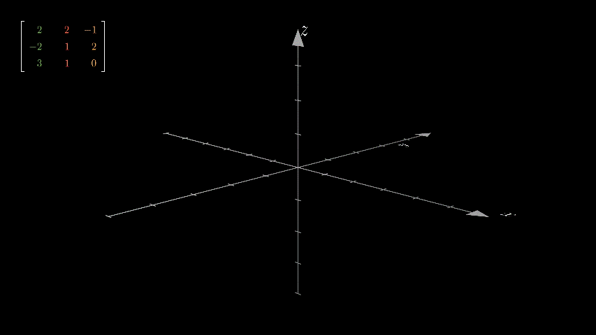

<p align="center">
    
</p>
<div align="center">


<br>
<br>


<br>
<br>


<br>
<br>


<br>
<br>

[](https://opensource.org/licenses/MIT)
<br>
</div>

# Mathe GFS

Alles zur Mathe GFS

## News

- **[2024.10.31]** Start ;-)
- **[2024.11.08]** [Demo](#demo)

## Inhaltsverzeichnis
- [Demo](#demo)
- [Installation](#installation)
- [Checkliste](#checkliste)
- [Lizenz](#lizenz)

---

## Demo

<p align="center">
    
    
    
</p>

## Installation

### 1. Klone das Repository:
```bash
git https://github.com/Peharge/Woyzy
   ```
### 2. Navigiere in das Projektverzeichnis:
```bash
cd Woyzy
```
### 3. Installation von Manim :
```bash
pip install manim
```
### 4. Test:
```bash
cd python-main
```
```bash
manim -p -r 3840,2160 main1.py ContinuousMotion
```

## Checkliste

Hier ist die To-Do-Liste für die wichtigsten Tools und Aufgaben im Projekt:

## Aufgaben

| **Task** | **Beschreibung** | **Status** |
|----------|------------------|------------|
| Task 1   |                  | ❌          |


Nicht erledigt ❌ | Erledigt (min. 1 Monat) ✔️ | Verbesserungen nötig 🔧 | In Bearbeitung 🔄 | Verbesserungen erforderlich ⚠️

## Lizenz

Dieses Projekt ist unter der MIT-Lizenz lizenziert – siehe die [LICENSE](LICENSE) Datei für Details.
